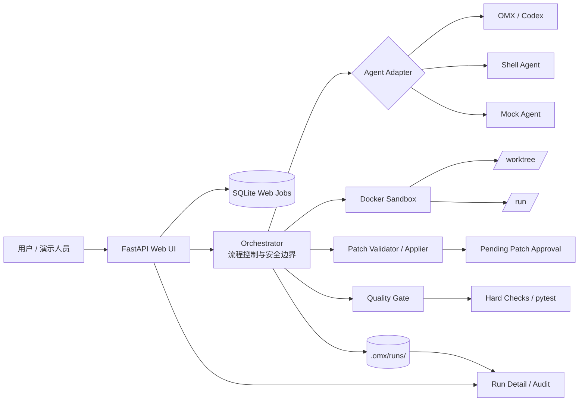
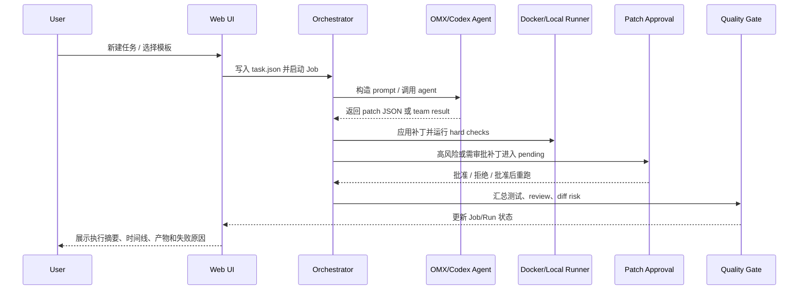

# Evoloop

Evoloop 是一个自动循环进化编码智能体系统原型。它把任务提交、智能体执行、补丁生成、安全校验、测试回归、质量门禁、人工审批和运行审计串成一条可观察的闭环。

当前重点是让 Orchestrator 负责流程控制和安全边界，让 OMX/Codex/本地或 Docker agent 负责执行，让 Web UI 提供可上手的任务管理体验。

## 常用链接

- GitHub 仓库：[onlycaizhongwen/evoloop](https://github.com/onlycaizhongwen/evoloop)
- 本地任务管理页：[http://127.0.0.1:8765/tasks?page=1&page_size=10](http://127.0.0.1:8765/tasks?page=1&page_size=10)
- 本地首页：[http://127.0.0.1:8765/](http://127.0.0.1:8765/)
- 当前状态文档：[docs/codex/v1/status.md](docs/codex/v1/status.md)
- V7 架构设计：[docs/codex/v1/designs/自动循环进化编码智能体系统-v7.md](docs/codex/v1/designs/自动循环进化编码智能体系统-v7.md)
- Agent 协议：[docs/codex/v1/designs/自动循环进化编码智能体系统-agent-protocol.md](docs/codex/v1/designs/自动循环进化编码智能体系统-agent-protocol.md)
- Docker 沙箱设计：[docs/codex/v1/designs/docker-sandbox-runner-design.md](docs/codex/v1/designs/docker-sandbox-runner-design.md)
- Web UI 迭代记录：[docs/codex/v1/plans/web-ui-task-template-management.md](docs/codex/v1/plans/web-ui-task-template-management.md)
- 演示脚本：[docs/codex/v1/plans/自动循环进化编码智能体系统-demo-script.md](docs/codex/v1/plans/自动循环进化编码智能体系统-demo-script.md)
- 演讲大纲：[docs/codex/v1/presentation/自动循环进化编码智能体系统-演讲大纲.md](docs/codex/v1/presentation/自动循环进化编码智能体系统-演讲大纲.md)

## 阅读路径

- 想快速试用：先看[快速启动 Web UI](#快速启动-web-ui)，打开[任务管理页](http://127.0.0.1:8765/tasks?page=1&page_size=10)，选择 `Docker OMX Team Patch` 模板跑一个任务。
- 想对外演示：先看[架构概览](#架构概览)和[自动循环流程](#自动循环流程)，再按[演示脚本](docs/codex/v1/plans/自动循环进化编码智能体系统-demo-script.md)准备讲解顺序。
- 想评审方案：先看[V7 架构设计](docs/codex/v1/designs/自动循环进化编码智能体系统-v7.md)、[Agent 协议](docs/codex/v1/designs/自动循环进化编码智能体系统-agent-protocol.md)和[Docker 沙箱设计](docs/codex/v1/designs/docker-sandbox-runner-design.md)。
- 想继续开发：从[核心代码入口](#核心代码入口)进入，再结合[Web UI 迭代记录](docs/codex/v1/plans/web-ui-task-template-management.md)确认最近改动。

## 当前能力

- Web UI 任务管理：`/tasks` 提供任务列表、运行中/已完成/失败/已停止筛选、搜索、分页、新建任务弹窗、停止、删除、重新运行。
- 任务模板：内置 `Local OMX Team Patch`、`Docker OMX Team Patch`、`Docker Patch JSON` 和 `Mock Flow Demo`，避免用户手写复杂命令。
- OMX/Codex 执行适配：支持 `mock`、`shell`、`codex`、`omx`、`omx_patch`、`omx_team_patch` agent mode。
- Docker 沙箱：Docker backend 使用安全的 `/worktree`、`/run`、`/cache` 路径约束，运行证据写入 run 日志。
- 补丁审批：agent 产出的 patch JSON/team result 会进入 pending patch 流程，支持 Web 审批、拒绝、审批后重新验证。
- 执行链路：Job 和 Run 页面展示 Web UI、Orchestrator、Agent、执行环境、Patch、Quality Gate 的链路摘要。
- 运行详情：Run 详情页展示任务元数据、失败原因、执行摘要、阶段时间线、执行链路、运行产物、Docker 证据、最终报告和诊断日志。
- 任务控制：Web 启动的 local/Docker 命令会注册到取消表，停止任务时会尝试终止底层进程。
- 重跑体验：完成、失败或已停止的任务可以从任务列表或详情页重新运行；缺少原始 `task.json` 时会显示明确原因和恢复入口。

## 架构概览



## 自动循环流程



## 项目结构

```text
orchestrator/
  application/          # 用例、DTO、任务模板注册
  domain/               # 状态、质量门禁、安全策略、review 校验
  infrastructure/       # agent、命令执行、Docker、本地持久化、patch 服务
  interfaces/
    cli/                # 命令行入口
    web/                # FastAPI Web UI
  report/               # final_report 输出
docs/codex/v1/          # 需求、设计、计划、追踪和状态文档
examples/               # 示例任务与 smoke 资源
tests/                  # pytest 回归测试
```

## 核心代码入口

- Web UI 入口：[orchestrator/interfaces/web/main.py](orchestrator/interfaces/web/main.py)
- Web 任务管理模板：[orchestrator/interfaces/web/templates/tasks.html](orchestrator/interfaces/web/templates/tasks.html)
- Run 详情模板：[orchestrator/interfaces/web/templates/run_detail.html](orchestrator/interfaces/web/templates/run_detail.html)
- 任务模板注册：[orchestrator/application/task_template_registry.py](orchestrator/application/task_template_registry.py)
- 任务执行用例：[orchestrator/application/use_cases/run_task.py](orchestrator/application/use_cases/run_task.py)
- Docker 沙箱执行器：[orchestrator/infrastructure/command/docker_sandbox_runner.py](orchestrator/infrastructure/command/docker_sandbox_runner.py)
- OMX team patch agent：[orchestrator/infrastructure/agents/omx_team_patch_agent.py](orchestrator/infrastructure/agents/omx_team_patch_agent.py)
- Pending patch 服务：[orchestrator/infrastructure/patches/pending_patch_service.py](orchestrator/infrastructure/patches/pending_patch_service.py)

## 快速启动 Web UI

先确认 Python 环境已安装项目依赖，并且本机已安装 OMX。使用 Docker 模板前，需要先启动 Docker Desktop。

启动 Web：

```bash
python -m orchestrator.interfaces.web.main
```

打开：

```text
http://127.0.0.1:8765/tasks?page=1&page_size=10
```

推荐先进入任务管理页，点击 `新建任务`，优先选择 `Docker OMX Team Patch` 模板。新建弹窗按基础信息、执行方式、工作区与权限、验证配置和高级配置分区，并会在提交前展示“将会如何执行”的摘要。

模板建议：

- `Docker OMX Team Patch`：推荐路径，使用 Docker 沙箱运行 team result backend。
- `Docker Patch JSON`：单 agent patch JSON 验证路径。
- `Local OMX Team Patch`：本地 OMX team result 风格任务。
- `Mock Flow Demo`：不调用真实外部 agent，用于验证 Orchestrator 状态流转。

提交后会进入 Job 状态页。任务完成后可进入 Run 详情页查看最终报告、补丁审批、运行产物、阶段时间线和 Docker 执行证据。

## 任务管理

任务管理页支持：

- 按 `全部`、`运行中`、`已完成`、`失败`、`已停止` 筛选。
- 搜索任务名称、Task ID、Job ID、Run ID、模板、backend、agent 和状态文本。
- 分页查询并调整每页数量。
- 对运行中任务执行 `停止`。
- 对非运行中任务执行 `重新运行`。
- 删除任务列表记录，但保留 run 审计目录。

如果重新运行时找不到原始 `task.json`，页面会显示 `无法重新运行`，并提供 `返回任务管理` 和 `新建任务` 入口。

## CLI 使用

运行一个任务：

```bash
python -m orchestrator.interfaces.cli.main run --task path/to/task.json --agent mock
```

启用真实检查命令：

```bash
python -m orchestrator.interfaces.cli.main run --task path/to/task.json --agent omx_team_patch --real-checks
```

查看历史 run：

```bash
python -m orchestrator.interfaces.cli.main resume --run-id <run_id>
```

从历史 run 重新运行：

```bash
python -m orchestrator.interfaces.cli.main resume --run-id <run_id> --rerun --real-checks
```

查看待审批补丁：

```bash
python -m orchestrator.interfaces.cli.main patches list --run-id <run_id>
```

审批并重新验证：

```bash
python -m orchestrator.interfaces.cli.main patches apply --run-id <run_id> --patch <patch_file> --reviewer cli --rerun-task
```

## 运行产物

默认运行产物写入 `.omx/`：

```text
.omx/
  orchestrator.db       # Web Job SQLite 状态
  web-tasks/            # Web 提交生成的 task.json
  runs/<run_id>/        # 单次运行审计目录
    task.json
    run_state.json
    final_report.md
    logs/
      phase.log
      heartbeat.log
      agent.log
      docker_sandbox.jsonl
```

Web UI 不会因为删除任务列表记录而删除 run 审计目录。Run 目录是排查和复盘的主要依据。

## Docker 沙箱说明

Docker 模板会把执行限制在容器内的安全路径：

- `/worktree`：任务工作区挂载路径
- `/run`：运行时文件路径
- `/cache`：缓存路径

Web UI 的 Docker agent 命令预设会自动生成容器内命令，例如：

```bash
python /worktree/docker_team_backend.py {task_id} {prompt_file}
```

这样可以避免用户手写 Windows 宿主路径、错误挂载路径或不安全命令。

## 验证

当前已验证基线：

```bash
python -m pytest -q tests/test_web_ui.py
# 48 passed

python -m pytest -q
# 133 passed
```

真实 Docker 模板已验证过完整闭环：Web 提交 -> Docker agent 生成 team result -> Orchestrator 应用 patch -> Docker hard check -> Run detail 展示 Docker 证据。

## 推荐使用流程

1. 启动 Web UI。
2. 进入 `/tasks`。
3. 点击 `新建任务`。
4. 优先选择 `Docker OMX Team Patch` 模板。
5. 提交任务，等待 Job 状态变化。
6. 进入 Run 详情查看执行摘要、运行产物、阶段时间线、失败原因或最终报告。
7. 如果生成待审批补丁，检查补丁预览后选择批准并验证或拒绝。
8. 对失败、已停止或已完成任务，可在任务列表直接点击 `重新运行`。

## 当前边界

- 系统仍是原型阶段，重点验证自动循环编码闭环和可观测性。
- 真实 Codex/OMX 能力依赖本机已安装并可用的 `omx`、Codex CLI 和对应认证配置。
- Docker 模板依赖 Docker Desktop 正常运行。
- Web UI 当前面向本地开发和演示环境，不建议直接暴露到公网。
