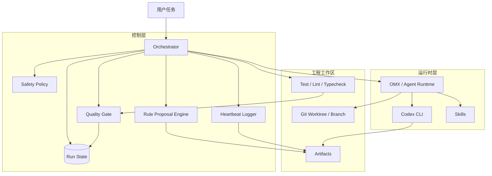
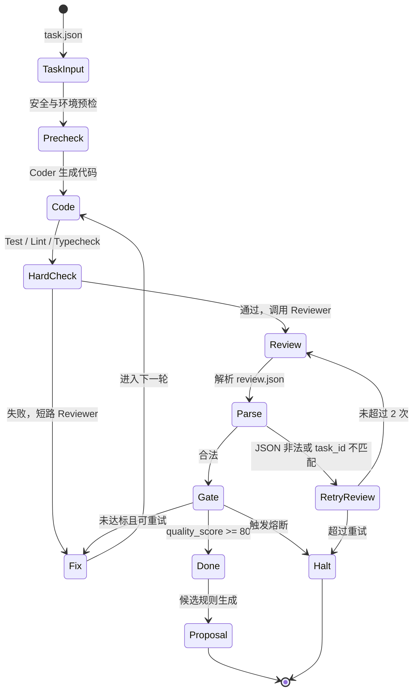

# 自动循环进化编码智能体系统 - 对外技术方案

## 1. 方案摘要

自动循环进化编码智能体系统是一套面向工程交付的 AI 编码流水线。它不把“模型回答”直接视为交付结果，而是通过自动编码、硬性检查、结构化审查、质量门控、安全策略和状态持久化，形成一个可控的单任务闭环。

系统的第一阶段目标是 MVP：单任务自动循环。后续再扩展到多 Agent 并行、任务队列和受控技能进化。

## 2. 设计原则

- 先可控，再自动。
- 先单任务闭环，再多 Agent 编排。
- 质量门控不能只依赖模型置信度。
- 安全策略必须前置于自动执行。
- 技能进化只能提案，不能默认自动生效。
- 所有关键决策必须可恢复、可审计。

## 3. 总体架构



## 4. 核心模块

| 模块 | 职责 |
| :--- | :--- |
| Orchestrator | 主控流程，负责读取任务、调用 Agent、执行门控、维护状态 |
| Agent Adapter | 封装 OMX/Codex CLI 调用 |
| Check Runner | 执行测试、Lint、类型检查 |
| Review Parser | 解析 Reviewer JSON，处理 malformed JSON 重试和 task_id 校验 |
| Quality Gate | 计算质量分，做出 done/retry/halt 决策 |
| Safety Policy | 管理权限、路径、命令和风险边界 |
| State Store | 保存 run_state、attempt 产物、最终报告 |
| Heartbeat Logger | 输出阶段日志和长耗时命令心跳 |
| Rule Proposal Engine | 从日志中生成候选规则，不自动生效 |

## 5. 核心流程



## 6. 数据契约

### 6.1 task.json

`task.json` 是任务入口，至少包含：

- `task_id`
- `title`
- `description`
- `change_type`
- `repo_path`
- `worktree_path`
- `allowed_paths`
- `forbidden_paths`
- `check_commands`
- `max_attempts`
- `max_review_json_retries`
- `heartbeat_interval_seconds`

`change_type` 支持：

- `feature`
- `bugfix`
- `refactor`
- `config`

### 6.2 review.json

Reviewer 必须输出：

- `schema_version`
- `task_id`
- `pass`
- `confidence`
- `summary`
- `issues`
- `blocking`
- `recommended_next_action`

解析成功后必须校验：

```python
review.task_id == task.task_id
```

不一致时按 malformed review 处理。

### 6.3 quality_report.json

质量报告记录：

- `task_id`、`attempt`、`change_type`
- `hard_check_score`
- `review_schema_valid`、`review_json_retry_count`
- `review_pass`、`review_confidence`、`review_score`
- `diff_risk_score`
- `quality_score`、`passed`、`decision`、`reason`

当前 MVP 实现采用扁平 JSON 结构，Hard Check 的逐命令明细单独写入同一 attempt 目录下的 `hard_checks.json`，`quality_report.json` 只保留质量门控所需的汇总字段。

## 7. 质量门控

### 7.1 Hard Check 短路

如果测试、Lint 或类型检查失败：

- 不调用 Reviewer。
- 不计算最终质量分。
- 直接进入 Fix 或 Halt。

### 7.2 综合评分

| 项目 | 分值 |
| :--- | ---: |
| 测试通过 | 40 |
| Lint 通过 | 10 |
| 类型检查通过 | 10 |
| Review 通过 | 20 |
| Reviewer 置信度 | 10 |
| Diff 风险 | 10 |

通过条件：

- 总分 `>= 80`
- 无阻断项
- 未触发安全策略
- 未触发熔断

## 8. 安全策略

### 8.1 权限等级

| 等级 | 允许行为 |
| :--- | :--- |
| read-only | 搜索、读取、查看 diff |
| workspace-write | 修改允许路径内文件、运行测试 |
| elevated | 修改配置、CI、迁移、部署相关文件 |
| forbidden | 删除仓库、读取密钥、生产操作 |

### 8.2 config 权限映射

当 `change_type=config`：

1. 先检查目标路径是否命中 `forbidden_paths`。
2. 命中则直接阻断。
3. 未命中则映射为 `elevated`。
4. 记录日志：`reason=change_type_config_requires_elevated`。

### 8.3 路径约束

所有写入必须满足：

- 在 `worktree_path` 内。
- 属于 `allowed_paths`。
- 不属于 `forbidden_paths`。
- 不通过符号链接逃逸工作区。

## 9. 状态与产物

建议目录：

```text
.omx/runs/{run_id}/
├── task.json
├── run_state.json
├── attempts/
│   └── 001/
│       ├── hard_checks.json
│       ├── review.json
│       ├── malformed_review_1.txt
│       ├── quality_report.json
│       └── agent.log
├── pending-rules/
└── final_report.md
```

## 10. 受控技能进化

系统可以根据重复错误生成候选规则，但规则默认进入 `pending-rules/`，不得自动写入正式 Skill。

候选规则必须包含：

- 来源任务。
- 触发证据。
- 问题模式。
- 建议规则。
- 适用范围。
- 不适用范围。
- 审核状态。

## 11. MVP 验收

- 能完成单个 bugfix 闭环。
- Hard Check 失败能短路。
- Review JSON 非法能重试。
- task_id 不一致能阻断。
- Diff 风险能量化。
- config 类型能触发 elevated。
- 能输出 final report。

## 12. 后续演进

- 多任务队列。
- Architect 自动生成计划。
- `$team` 并行执行。
- 可视化 Dashboard。
- Rule Proposal 审核流。
- 更细粒度权限沙箱。
