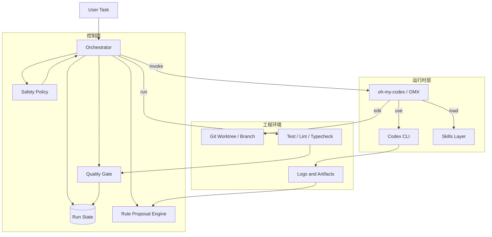
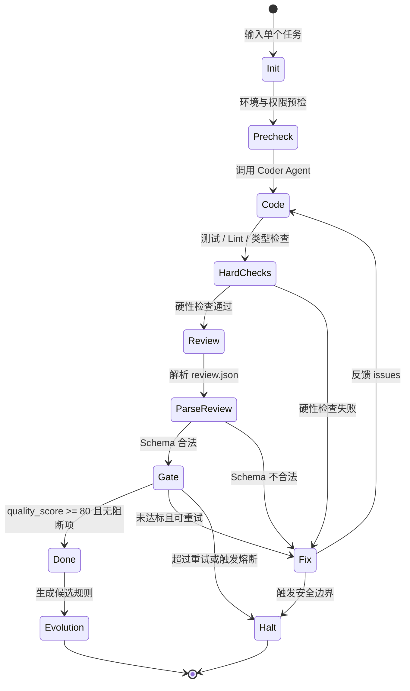
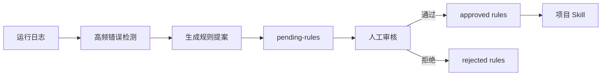

# 自动循环进化编码智能体系统 - 架构与需求设计文档 V3

## 1. 背景与目标

本项目旨在构建一个基于 oh-my-codex（OMX）、Codex CLI 与 Skills 机制的自动循环编码智能体系统。系统目标不是一次性实现完全自治的“自我进化程序员”，而是先落地一个可验证、可恢复、可审计的半自动编码流水线，再逐步扩展到多 Agent 协作与受控技能进化。

V3 相比 V2 的核心调整：

- 将 MVP 范围收敛为“单任务闭环执行器”，避免 Orchestrator 过早承担复杂 DAG 和全量多 Agent 调度。
- 将模型自报置信度改为综合质量评分，测试、静态检查、Schema 校验和审查结论共同决定是否通过。
- 将技能进化改为候选规则提案制，默认不自动写入正式 Skill。
- 补齐关键数据契约、状态流、权限模型和熔断条件。
- 使用标准 Markdown、Mermaid 与表格格式，便于后续直接进入计划阶段。

## 2. 范围与边界

### 2.1 MVP 范围

MVP 只实现单任务自动循环：

1. 接收一个明确的工程任务。
2. 调用 Coder Agent 生成或修改代码。
3. 执行测试、Lint、类型检查等硬性检查。
4. 调用 Reviewer Agent 输出结构化审查 JSON。
5. Orchestrator 校验 JSON Schema 并计算质量分。
6. 达标则结束并输出报告；不达标则把问题反馈给 Fixer/Coder 继续迭代。
7. 超过重试、风险或权限边界时暂停并请求人工介入。

### 2.2 MVP 非目标

MVP 阶段不做以下能力：

- 不做复杂任务 DAG 自动拆分。
- 不做多任务并行合并。
- 不做自动创建 PR 或自动合并主分支。
- 不做自动修改正式 Skill。
- 不做 Web Dashboard，仅输出 CLI 日志与结构化运行报告。
- 不处理数据库迁移、生产配置、线上发布等高风险变更。

### 2.3 后续扩展范围

MVP 稳定后再逐步扩展：

- Architect 生成 `plan.json` 并进入任务队列。
- `$team` 多 Agent 并行执行独立任务。
- pending-rules 人工审核后进入项目 Skill。
- 运行指标与历史任务可视化。
- 跨仓库或跨模块的长期演进记忆。

## 3. 总体架构



## 4. 模块设计

| 模块 | 职责 | MVP 是否实现 |
| :--- | :--- | :--- |
| Orchestrator | 读取任务、调用 Agent、维护状态、执行门控、控制重试 | 是 |
| Agent Adapter | 封装 OMX/Codex CLI 调用，屏蔽命令行差异 | 是 |
| Check Runner | 执行测试、Lint、类型检查、覆盖率命令 | 是 |
| Review Parser | 提取 Reviewer JSON，做 Schema 校验 | 是 |
| Quality Gate | 计算综合质量分，决定通过、重试或暂停 | 是 |
| Safety Policy | 限制命令、路径、环境变量、文件操作范围 | 是 |
| State Store | 保存任务状态、尝试次数、检查结果、审查结果 | 是 |
| Evolution Proposal Engine | 根据日志生成候选规则，不自动生效 | MVP 可选 |
| Dashboard | 展示运行进度、历史质量趋势 | 否 |
| DAG Planner | 根据需求自动拆分多任务计划 | 否 |

## 5. 核心流程



## 6. 数据契约

### 6.1 task.json

```json
{
  "task_id": "task-001",
  "title": "修复登录接口空指针问题",
  "description": "当用户 profile 为空时，登录接口应返回可解释错误，而不是抛出异常。",
  "repo_path": "D:/project/app",
  "worktree_path": "D:/project/.worktrees/task-001",
  "allowed_paths": ["src/", "tests/", "docs/"],
  "forbidden_paths": [".env", "secrets/", "deploy/prod/"],
  "check_commands": {
    "test": "pytest",
    "lint": "ruff check .",
    "typecheck": "mypy src"
  },
  "max_attempts": 3,
  "risk_level": "medium"
}
```

### 6.2 review.json

```json
{
  "schema_version": "1.0",
  "task_id": "task-001",
  "pass": false,
  "confidence": 76,
  "summary": "核心逻辑基本正确，但缺少 profile 为空时的单元测试。",
  "issues": [
    {
      "id": "R001",
      "severity": "major",
      "category": "test_gap",
      "file": "tests/test_login.py",
      "line": 42,
      "message": "缺少 profile 为空的回归测试。",
      "suggestion": "新增 profile 为 None 时的测试用例。"
    }
  ],
  "blocking": true,
  "recommended_next_action": "fix"
}
```

### 6.3 quality_report.json

```json
{
  "task_id": "task-001",
  "attempt": 2,
  "hard_checks": {
    "test": {"passed": true, "score": 40},
    "lint": {"passed": true, "score": 10},
    "typecheck": {"passed": true, "score": 10}
  },
  "soft_checks": {
    "review_schema_valid": true,
    "review_pass": false,
    "review_confidence": 76,
    "review_score": 12,
    "diff_risk_score": 8
  },
  "quality_score": 80,
  "passed": false,
  "decision": "retry",
  "reason": "存在 blocking review issue"
}
```

### 6.4 run_state.json

```json
{
  "run_id": "run-20260521-001",
  "task_id": "task-001",
  "status": "retrying",
  "attempt": 2,
  "max_attempts": 3,
  "current_phase": "fix",
  "started_at": "2026-05-21T10:00:00+08:00",
  "updated_at": "2026-05-21T10:15:00+08:00",
  "artifacts": {
    "review": ".omx/runs/run-20260521-001/review.json",
    "quality_report": ".omx/runs/run-20260521-001/quality_report.json",
    "logs": ".omx/runs/run-20260521-001/logs/"
  }
}
```

### 6.5 pending rule proposal

```markdown
# Rule Proposal: RP-001

## Source

- task_id: task-001
- observed_count: 3
- first_seen: 2026-05-21

## Problem Pattern

访问可空对象属性时缺少空值保护，导致运行时异常。

## Proposed Rule

当对象来自外部输入、数据库、缓存或第三方接口时，访问嵌套属性前必须明确处理空值。

## Scope

- Applies to: Python service code, TypeScript service code
- Does not apply to: 已由类型系统证明非空的局部变量

## Review Status

- status: pending
- reviewer: TBD
```

## 7. 质量门控

### 7.1 硬性通过条件

以下任一失败，任务不得完成：

- 测试命令失败。
- Lint 命令失败。
- 类型检查命令失败。
- Reviewer JSON 无法解析或不符合 Schema。
- Review 中存在 `severity=critical` 的 issue。
- Review 中 `blocking=true`。
- diff 触及禁止路径。
- 触发安全策略。

### 7.2 评分模型

| 项目 | 分值 | 说明 |
| :--- | ---: | :--- |
| 测试通过 | 40 | 单元测试或项目配置的默认测试命令 |
| Lint 通过 | 10 | 无格式或静态扫描错误 |
| 类型检查通过 | 10 | TypeScript、mypy、pyright 等 |
| Review 通过 | 20 | `pass=true` 且无阻断 issue |
| Reviewer 置信度 | 10 | `confidence >= 80` 得满分，否则按比例折算 |
| Diff 风险 | 10 | 修改范围小、未触碰敏感路径、无异常大 diff |

通过条件：

- `quality_score >= 80`
- 所有硬性通过条件满足
- 未触发熔断

### 7.3 Diff 风险规则

| 条件 | 处理 |
| :--- | :--- |
| 修改文件数超过 12 个 | 暂停，要求人工确认 |
| 单次 diff 超过 800 行 | 暂停，要求人工确认 |
| 修改 `deploy/`、`.github/workflows/`、数据库迁移目录 | 暂停，要求人工确认 |
| 修改 `.env`、密钥、认证配置 | 阻断 |
| 删除大量文件 | 阻断 |

## 8. 安全策略

### 8.1 权限等级

| 等级 | 允许行为 | 适用阶段 |
| :--- | :--- | :--- |
| read-only | 读取文件、搜索、查看 git diff | 需求理解、审查 |
| workspace-write | 修改允许路径内文件、运行测试 | MVP 默认 |
| elevated | 修改配置、CI、迁移、部署相关文件 | 需人工确认 |
| forbidden | 删除仓库、读取密钥、生产操作 | 永不自动执行 |

### 8.2 命令策略

优先使用允许列表：

- `git status`
- `git diff`
- `pytest`
- `npm test`
- `pnpm test`
- `ruff check`
- `eslint`
- `mypy`
- `tsc --noEmit`

高风险命令默认阻断或人工确认：

- 删除类：`rm -rf`、`Remove-Item -Recurse`、`del /s`
- 磁盘类：`format`、`mkfs`
- 权限类：`chmod -R 777`
- 网络下载执行类：`curl ... | sh`、`Invoke-WebRequest ... | iex`
- 数据库破坏类：`DROP TABLE`、`TRUNCATE`、无条件 `DELETE`
- 密钥读取类：读取 `.env`、`id_rsa`、token 文件

### 8.3 路径策略

所有写入必须满足：

- 目标路径在 `worktree_path` 内。
- 目标路径属于 `allowed_paths`。
- 目标路径不在 `forbidden_paths`。
- 不允许通过符号链接逃逸工作区。

## 9. Orchestrator 设计

### 9.1 MVP 模块边界

```text
orchestrator/
├── main.py              # CLI 入口
├── config.py            # 读取任务与策略配置
├── agent_adapter.py     # OMX/Codex CLI 调用封装
├── checks.py            # 测试、Lint、类型检查执行
├── review.py            # Reviewer 调用与 JSON 解析
├── gate.py              # 质量评分与决策
├── safety.py            # 命令与路径安全策略
├── state.py             # run_state 持久化
└── evolution.py         # 候选规则生成
```

### 9.2 主循环伪代码

```python
def run_task(task):
    state = init_state(task)
    safety.precheck(task)

    while state.attempt < task.max_attempts:
        state.attempt += 1

        agent_adapter.run_coder(task, state)
        hard_result = checks.run_all(task)

        if not hard_result.passed:
            if gate.should_halt(hard_result, state):
                return halt(state, hard_result)
            agent_adapter.run_fixer(task, hard_result)
            continue

        review = review_agent.run_and_parse(task)
        quality = gate.evaluate(task, hard_result, review)
        state.save(quality)

        if quality.passed:
            evolution.generate_candidates_if_needed(state)
            return done(state, quality)

        if gate.should_halt(quality, state):
            return halt(state, quality)

        agent_adapter.run_fixer(task, quality)

    return halt(state, reason="max_attempts_exceeded")
```

## 10. 状态与产物目录

建议运行产物存放在 `.omx/runs/{run_id}/`：

```text
.omx/runs/run-20260521-001/
├── task.json
├── run_state.json
├── attempts/
│   ├── 001/
│   │   ├── hard_checks.json
│   │   ├── review.json
│   │   ├── quality_report.json
│   │   └── agent.log
│   └── 002/
├── pending-rules/
│   └── RP-001.md
└── final_report.md
```

## 11. 熔断与人工介入

触发以下任一条件时暂停：

- 达到最大尝试次数。
- 同一个测试失败连续出现 2 次，且错误栈无变化。
- 同一文件被反复修改超过 3 次仍未通过。
- Agent 输出无法形成合法 JSON 超过 2 次。
- 修改范围超过 Diff 风险阈值。
- 触及 elevated 权限路径。
- 触发 forbidden 命令或路径。
- Reviewer 给出 `critical` issue。

暂停时必须输出：

- 当前状态。
- 最近一次失败原因。
- 已修改文件列表。
- 建议人工处理动作。
- 是否可安全继续重试。

## 12. 受控技能进化

技能进化只生成候选规则，不自动生效。



候选规则进入正式 Skill 前必须满足：

- 有明确来源任务。
- 有至少 2 到 3 次重复出现证据。
- 规则有适用范围和不适用范围。
- 不与现有规则冲突。
- 经人工审核或 PR 审核通过。

## 13. 风险与取舍

| 风险 | 影响 | V3 处理 |
| :--- | :--- | :--- |
| 模型置信度虚高 | 低质量代码被放行 | 综合质量评分，不单独依赖 confidence |
| Orchestrator 过重 | MVP 难以完成 | MVP 只做单任务闭环 |
| 自动技能进化污染规则 | 后续 Agent 被错误规则误导 | 候选规则提案制，人工审核后生效 |
| Full-auto 执行危险命令 | 数据或代码损坏 | 权限等级、路径限制、命令策略 |
| Agent 输出格式不稳定 | 自动化流程中断 | JSON Schema 校验，不合法则重试或暂停 |
| 多 Agent 合并冲突 | 代码冲突和状态混乱 | MVP 不做并行合并，后续通过 worktree 隔离 |

## 14. 验收标准

MVP 完成标准：

- 能读取 `task.json` 并创建运行状态。
- 能调用 Coder/Fixer 完成一次代码修改循环。
- 能执行配置的测试、Lint、类型检查命令。
- 能调用 Reviewer 并解析合法 `review.json`。
- 能生成 `quality_report.json`。
- 能根据质量门控做出 `done`、`retry`、`halt` 决策。
- 能在触发熔断时输出可读的人工介入报告。
- 能生成 pending rule proposal，但不会自动修改正式 Skill。

## 15. 推荐后续计划

下一阶段建议进入执行计划文档，按以下里程碑拆分：

1. Orchestrator CLI 骨架与 `task.json` 读取。
2. 安全策略与路径校验。
3. Check Runner 与质量门控。
4. Reviewer JSON Schema 与解析。
5. Agent Adapter 接入 OMX/Codex CLI。
6. 状态持久化与最终报告。
7. pending-rules 候选规则生成。

## 16. 可行性与自信度

基于 V3 的收敛范围和约束，评估如下：

- MVP 可行性：88 / 100
- 工程化长期运行可行性：76 / 100
- 受控技能进化可靠性：68 / 100
- 综合可行性：80 / 100
- 对本方案评估的自信度：88 / 100

结论：V3 已具备进入计划阶段的条件。建议先实现单任务闭环 MVP，通过真实仓库中的小任务验证门控、重试和熔断，再扩展多 Agent 并行与长期技能进化。
