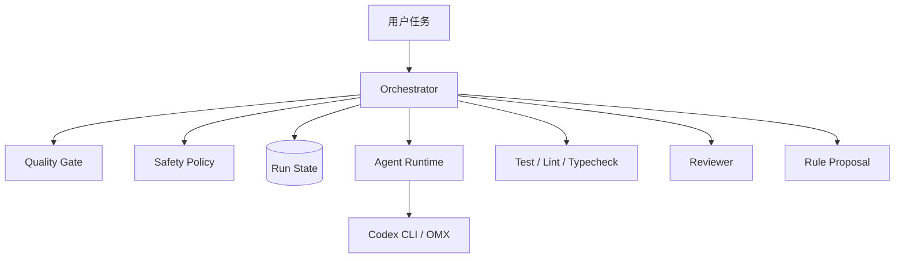

# 自动循环进化编码智能体系统 - 对外演讲大纲

## 1. 演讲定位

主题：从“AI 会写代码”到“AI 可控交付代码”

核心观点：

AI 编码的关键不只是生成代码，而是让代码进入可验证、可审计、可恢复、可治理的工程闭环。

## 2. 推荐标题

可选标题：

- 自动循环进化编码智能体系统：面向工程交付的 AI 编码闭环
- 从 Copilot 到 Coding Agent：如何让 AI 编码可控落地
- AI 自动编码的下一步：质量门控、安全边界与受控进化

## 3. 听众画像

| 听众 | 关心点 | 讲法重点 |
| :--- | :--- | :--- |
| 技术管理者 | ROI、风险、路线图 | 先 MVP 后演进，风险可控 |
| 架构师 | 架构边界、扩展性 | Orchestrator、Gate、Policy、State |
| 开发者 | 怎么用、能省什么 | 单任务闭环、失败可接手 |
| 安全/运维 | 会不会乱执行 | 权限等级、路径策略、heartbeat |
| 业务方 | 价值和结果 | 更快交付、更稳质量 |

## 4. PPT 结构

### Slide 1: 标题

自动循环进化编码智能体系统  
面向工程交付的 AI 编码闭环

讲述要点：

- 不是展示“AI 会写代码”。
- 重点是 AI 如何安全、稳定、可审计地交付代码。

### Slide 2: 背景问题

当前 AI 编码常见问题：

- 生成代码快，但质量不稳定。
- 模型说“我有信心”，但信心不可直接验收。
- 自动执行命令有安全风险。
- 多轮修复后上下文和状态容易丢。
- 经验沉淀难以复用。

### Slide 3: 核心理念

从 Prompt 到 Pipeline：

- Prompt 解决生成。
- Pipeline 解决交付。
- Gate 解决质量。
- Policy 解决安全。
- State 解决恢复。
- Evolution 解决经验沉淀。

### Slide 4: 一句话方案

系统通过 Orchestrator 调度 Agent 完成编码，并用 Hard Check、Reviewer、Quality Gate 和 Safety Policy 形成自动循环。

关键词：

- 自动编码
- 自动测试
- 自动审查
- 自动重试
- 自动暂停
- 受控进化

### Slide 5: 总体架构

建议放 V7 架构图：

讲述要点：

- Orchestrator 是流程控制，不负责“变聪明”。
- Agent 负责生成与修复。
- Gate 和 Policy 负责让系统可控。

### Slide 6: 核心闭环

流程：

1. 输入任务。
2. Agent 编码。
3. 测试、Lint、类型检查。
4. Reviewer 输出结构化 JSON。
5. Quality Gate 决策。
6. 失败则修复，超过边界则暂停。

重点强调：

- Hard Check 失败短路 Reviewer。
- Review JSON 异常可重试。
- task_id 强校验避免串任务。

### Slide 7: 质量门控

评分模型：

| 项目 | 分值 |
| :--- | ---: |
| 测试通过 | 40 |
| Lint 通过 | 10 |
| 类型检查通过 | 10 |
| Review 通过 | 20 |
| Reviewer 置信度 | 10 |
| Diff 风险 | 10 |

讲述要点：

- 不单独相信模型置信度。
- 把工程检查作为主要依据。
- 质量分只是最终决策的一部分，还要看阻断项。

### Slide 8: 安全边界

安全机制：

- `allowed_paths`
- `forbidden_paths`
- read-only / workspace-write / elevated / forbidden
- 危险命令阻断
- config 任务先 forbidden，再 elevated

讲述要点：

- 自动化越强，边界越要清晰。
- forbidden 永远优先。
- elevated 需要人工确认或显式配置。

### Slide 9: 状态与可恢复

运行产物：

- `run_state.json`
- `hard_checks.json`
- `review.json`
- `quality_report.json`
- `agent.log`
- `final_report.md`

讲述要点：

- 失败不是黑盒。
- 人可以从报告接手。
- 后续可以做 Dashboard。

### Slide 10: 受控技能进化

从失败中学习，但不自动污染规则：

1. 发现重复错误。
2. 生成候选规则。
3. 进入 pending-rules。
4. 人工审核。
5. 合并到正式 Skill。

讲述要点：

- 进化是受控的。
- 防止错误规则扩散。

### Slide 11: MVP 路线

阶段：

1. 单任务闭环。
2. Quality Gate。
3. Safety Policy。
4. Reviewer JSON 重试。
5. Final Report。
6. Pending Rule Proposal。

不做：

- 自动 PR。
- 多 Agent 并行。
- 生产操作。
- 自动改正式 Skill。

### Slide 12: Demo 场景

推荐演示：

Bugfix：用户 profile 为空导致登录接口异常。

演示流程：

1. 输入 `task.json`。
2. Agent 修改代码。
3. 测试失败一次。
4. Fixer 修复。
5. Reviewer 输出 JSON。
6. Gate 通过。
7. 输出 final report。

### Slide 13: 价值总结

价值：

- 提高小任务交付效率。
- 降低 AI 自动编码风险。
- 让质量判断可解释。
- 让失败可恢复。
- 让经验可沉淀。

### Slide 14: 下一步

下一步计划：

- 完成 MVP。
- 选择 1 到 2 个真实仓库试点。
- 收集失败样本。
- 优化 Quality Gate。
- 扩展多 Agent 和 Dashboard。

## 5. 演讲金句

- AI 写代码不是终点，AI 可控交付代码才是工程化起点。
- 我们不让模型的自信替代工程验证。
- 自动化越强，安全边界越要前置。
- 失败不可怕，不可恢复的失败才可怕。
- 技能进化不是自动改规则，而是把重复失败变成可审核的经验。

## 6. 可能被问到的问题

### Q1: 这和普通 AI 编码助手有什么区别？

普通助手偏生成，本系统偏交付闭环。它关注测试、审查、门控、安全、状态和恢复。

### Q2: 为什么不让 AI 直接自动合并？

MVP 阶段风险太高。先验证单任务闭环，自动合并应放在安全策略和质量门控稳定之后。

### Q3: 模型置信度可靠吗？

不直接可靠。所以系统只把置信度作为 10 分的一部分，主要依据是测试、Lint、类型检查和审查阻断项。

### Q4: 怎么防止危险命令？

通过权限等级、路径策略、命令策略和 forbidden 优先规则控制。配置类任务也会自动进入 elevated。

### Q5: 技能进化会不会把错误规则写进去？

不会自动写正式 Skill。系统只生成 pending rule proposal，需要人工审核。

## 7. 结尾页

结论：

这套系统的目标不是替代工程师，而是把 AI 编码纳入工程交付流程，让它更快，也更稳。
